# Single Moving Object Tracking uisng OpenCV-Python

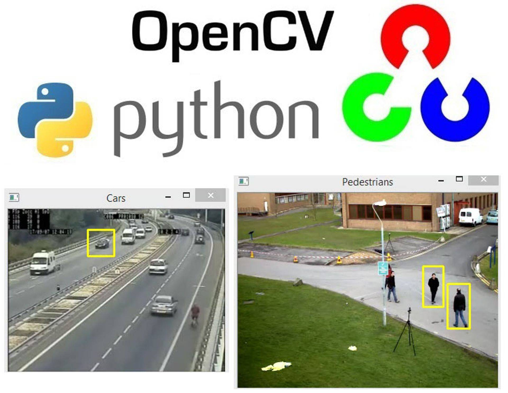

## 1. Objectives

The objective of this project is to demonstrate single moving object tracking using OpenCV-Python built-in tracking functionalities. We illustrate the development process step by step and illustrate the object tracking results.

## 2. Object Tracking

Object tracking is the task of taking an annotated or detected object of interest, localized within a bounding-box region of interest, and creating a unique ID for it, and then tracking the object location (bounding-box), as it moves around frames in a video, maintaining the ID assignment. 

* We shall demonstrate the tracking of a detected moving object using the following built-in OpenCV Python tracking functionalities:

  * Optical flow
  * Dense optical flow
  * Mean-Shift
  * Cam-Shift
  * BOOSTING 
  * MIL
  * KCF
  * TLD
  * MEDIAN FLOW

Details documentations of these tracking algorithms can be found in the references below.

## 3. Data

The input is a video with a cyclist, who represents our object of interest, as illustrated in the figure below:

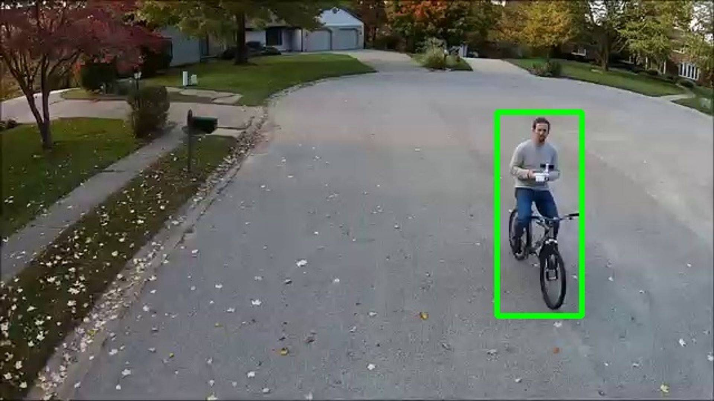

## 4. Development

In this section, we shall develop the object tracking algorithms using OpenCV Python and illustrate sample tracking results:

* Author: Mohsen Ghazel (mghazel)
* Date: April 7th, 2021
* Project: Object Tracking:

The objective of this project is to demonstrate the tracking of a single localized moving object using built-in OpenCV Python tracking functionalities:

  * Optical flow
  * Dense optical flow
  * Mean-Shift
  * Cam-Shift
  * BOOSTING 
  * MIL
  * KCF
  * TLD
  * MEDIAN FLOW

We shall assume the following:
  * The moving camera is moving
  * The object of interest is also moving
  * We have the bounding box location of the object of interest from the first video frame.
  * Our object is to track the object of interest in the remaining frames.

### 4.1. Step 1: Imports and global variables

<pre style="color:#000020;background:#e6ffff;font-size:10px;line-height:1.5;">#------------------------------------------------------
# Python imports and environment setup
#------------------------------------------------------
# opencv
import cv2
# numpy
import numpy as np
# matplotlib
import matplotlib.pyplot as plt
import matplotlib.image as mpimg

# input/output OS
import os 

# date-time to show date and time
import datetime

# Use %matplotlib notebook to get zoom-able &amp; resize-able notebook. 
# - This is the best for quick tests where you need to work interactively.
%matplotlib notebook

#------------------------------------------------------
# Test imports and display package versions
#------------------------------------------------------
# Testing the OpenCV version
print("OpenCV : ",cv2.__version__)
# Testing the numpy version
print("Numpy : ",np.__version__)

OpenCV :  3.4.8
Numpy :  1.19.2
</pre>

### 4.2. Step 2: Read the input video:

* We shall assume the following:

  * The camera is moving
  * The single object of interest is also moving
  * We have the bounding box location of the object of interest from the first video frame.

<pre style="color:#000020;background:#e6ffff;font-size:10px;line-height:1.5;">#----------------------------------------------------
# Open camera video file
#----------------------------------------------------
# the source video file name
video_file_path = "../resources/videos/cyclist.mp4"
# check if the reference image file exists
if(os.path.exists(video_file_path) == 0):
    print('Video file name DOES NOT EXIST! = ' + video_file_path)
# open the video file
cap = cv2.VideoCapture(video_file_path)
# check the status of the opened video file
if not cap.isOpened():
    print("Cannot read video file: " + video_file_path)
    exit();
# get the number of frames in the video file
num_video_frames = int(cap.get(cv2.CAP_PROP_FRAME_COUNT))
# display a message
print("Input video file: {0} has {1} frames.".format(video_file_path, num_video_frames))

Input video file: ../resources/videos/cyclist.mp4 has 3254 frames.
</pre>

### 4.3. Step 3: Grab the first frame of the video for manual annotation of the object of interest:

* Read the video frames
* Save the first frame to manually annotate the object of interest:
  * Object of interest annotation: the four corners of the bounding-box
    * TLC = (x1, y1)
    * TRC = (x2, y2)
    * BRC = (x3, y3)
    * BLC = (x4, y4)

<pre style="color:#000020;background:#e6ffff;font-size:10px;line-height:1.5;"># grab and save the first video frame.
for counter in range(1):
    #--------------------------------------------
    # Step 1: read the next video frame
    #--------------------------------------------
    ret, first_frame = cap.read();
    
    #--------------------------------------------
    # Step 2: save the first frame for annotation
    #--------------------------------------------
    # the first frame vfile name
    output_file_path = "../results/frame-" + str(counter) + ".jpg"
    # save the frame
    cv2.imwrite(output_file_path, first_frame);

#--------------------------------------------
# clear the video capture object:
#--------------------------------------------
cap.release();
# close all windows
cv2.destroyAllWindows();
</pre>

### 4.4. Step 4: Manually annotate of the object of interest from the first frame:

#### 4.4.1 Manually annotate of the object of interest from the first frame:

* The bounding-box of the object of interest annotation has the following coordinates:
    * b-box: (tlc_x, tlc_y, width, height) = (445, 100, 76, 183)
      * TLC = (445, 100)
      * TRC = (521, 100)
      * BRC = (521, 283)
      * BLC = (445, 283)

<pre style="color:#000020;background:#e6ffff;font-size:10px;line-height:1.5;">#--------------------------------------------
# The object of interest manually annotated 
# bounding-box:
#--------------------------------------------
# TLC coordinates: (tlc_x, tlc_y)
# tlc-x
tlc_x = 445
# tlc-y
tlc_y = 100
# the bounding-box dimension
# width
width = 76
# height
height = 183
</pre>

#### 4.4.2. Display the annotated bounding box of the object of interest on the first frame:

<pre style="color:#000020;background:#e6ffff;font-size:10px;line-height:1.5;">#--------------------------------------------
# Step 1: Read the first frame image
#--------------------------------------------
# the first frame file name
first_frame_file_path = "../results/frame-" + str(counter) + ".jpg"
# read the frame image
first_frame = cv2.imread(output_file_path);

#----------------------------------------
# Step 2: draw a GREEN rectangle to 
#        visualize the bounding rect
#        of the object of interest.
#----------------------------------------
cv2.rectangle(first_frame, (tlc_x, tlc_y), (tlc_x + width, tlc_y + height), (0, 255, 0), 3)

#----------------------------------------
# display the frame image with the 
# overlaid object of interest 
# bounding-box
#----------------------------------------
cv2.imshow("Object of interest", first_frame)
# wait to visualize the image
cv2.waitKey(0)
# close all windows
cv2.destroyAllWindows();

# save the figure
# the first frame file name
first_frame_file_path = "../results/frame-" + str(counter) + "-bbox-overlaid.jpg"
# save the frame
cv2.imwrite(first_frame_file_path, first_frame);
            
</pre>

### 4.5. Step 5: Track the object of interest:

* We are now ready to start tracking the moving object of interest bounding-box using built-in OpenCV Python tracking functionalities:
  * Optical flow
  * Dense optical flow
  * Mean-Shift
  * Cam-Shift
  * BOOSTING Tracker
  * MIL
  * KCF
  * TLD
  * MEDIAN FLOW

#### 4.5.1. Tracker: Lucas Kanade Optical Flow:
In this section, we shall compute Shi-Tomasi corners and track them using the Lucas-Kanade Optical Flow tracker:
From the first frame, we compute compute Shi-Tomasi corners from within the object of interest ROI selected above
Then we apply the Lucas-Kanade Optical Flow algorithm to track these features in the subsequent frames.

##### 4.5.1.1. Set the Shi-Tomasi corner detector parameters:

<pre style="color:#000020;background:#e6ffff;font-size:10px;line-height:1.5;"># Parameters for Shi-Tomasi corner detection (good features to track paper)
corner_track_params = dict(maxCorners = 10,
                       qualityLevel = 0.3,
                       minDistance = 7,
                       blockSize = 7 )
</pre>

##### 4.5.1.2. Set the Lucas-Kanade optical flow parameters:

<pre style="color:#000020;background:#e6ffff;font-size:10px;line-height:1.5;"># Parameters for lucas kanade optical flow
lk_params = dict( winSize  = (200,200),
                  maxLevel = 2,
                  criteria = (cv2.TERM_CRITERIA_EPS | cv2.TERM_CRITERIA_COUNT, 10,0.03))
</pre>

##### 4.5.1.3. Create a mask to focus on the selected object of interest ROI:

* Anything outside the object of interest bounding-box will be masked-out

<pre style="color:#000020;background:#e6ffff;font-size:10px;line-height:1.5;"># create a zero-mask with  the same size as the image
roi_mask = np.uint8(np.zeros((img.shape[0], img.shape[1]), dtype=int))
# set the pixels inside the object of interest bounding-box to 1
roi_mask[tlc_y: tlc_y + height, tlc_x: tlc_x + width] = 1
</pre>

##### 4.5.1.4. Read the first frame and compute features within the object of interest ROI to track:

* We only compute Harris corners inside the object of interest ROI
* We shall then track these features in subsequent frames, using the Optical flow algorithm

<pre style="color:#000020;background:#e6ffff;font-size:10px;line-height:1.5;"># open the video file
cap = cv2.VideoCapture(video_file_path)
# check the status of the opened video file
if not cap.isOpened():
    print("Cannot read video file: " + video_file_path)
    exit();

# Grab the very first frame of the stream
ret, prev_frame = cap.read()

# Convert to grayscale image if it is RGB
if ( len(prev_frame.shape) &gt; 2 ):
    prev_gray = cv2.cvtColor(prev_frame, cv2.COLOR_BGR2GRAY)
else:
    prev_gray = prev_frame.copy()

# Since we only want to compute Harris corners features to track 
# inside the object of interest ROI:
#  - we need to apply the mask
prev_gray = np.uint8(np.multiply(prev_gray, roi_mask))

# compute the Harris corner
prevPts = cv2.goodFeaturesToTrack(prev_gray, mask = None, **corner_track_params)
# display a message
print('Number of detected Harris corners = ' + str(prevPts.shape[0]))
# Drawing circles around corners
for i in range(prevPts.shape[0]):
    temp = np.squeeze(prevPts[i])
    cv2.circle(first_frame, (temp[0], temp[1]), 5, (0, 0, 255), 3)
# Showing the result
cv2.namedWindow("Detected Harris corners")
# display the image with overlaid features
cv2.imshow("Detected Harris corners", first_frame)
# save the figure
# the first frame file name
first_frame_file_path = "../results/frame-1-harris-corners-overlaid.jpg"
# save the frame
cv2.imwrite(first_frame_file_path, first_frame);
# wait to visualize the image
cv2.waitKey(0)
# close all windows
cv2.destroyAllWindows();  

Number of detected Harris corners = 10
</pre>

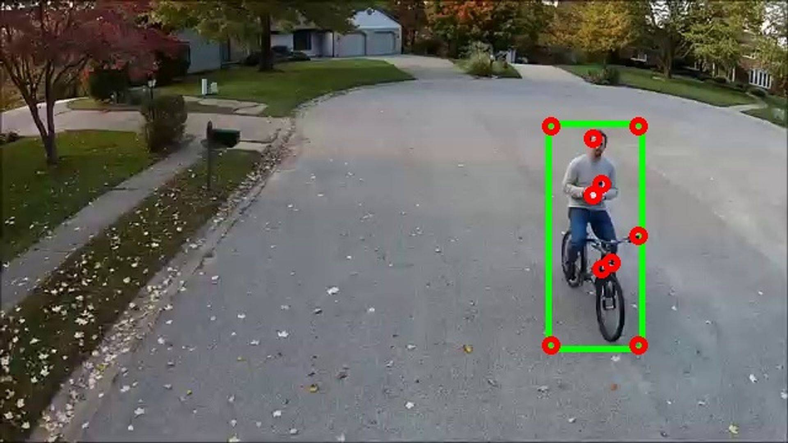

##### 4.5.1.5. Track the computed features within the object of interest ROI to track using Lucas-Kanade Optical Flow:

* Next, we start tracking these features in subsequent frames, using the Lucas-Kanade Optical flow algorithm

<pre style="color:#000020;background:#e6ffff;font-size:10px;line-height:1.5;"># Create a matching mask of the previous frame for drawing on later
mask = np.zeros_like(prev_frame)

# frame counter
frame_counter = 1;

# read the subsequent video frames
while True:
    
    # Grab current frame
    ret,frame = cap.read()
    
    # Grab gray scale
    frame_gray = cv2.cvtColor(frame, cv2.COLOR_BGR2GRAY)
    
    # Calculate the Optical Flow on the Gray Scale Frame
    nextPts, status, err = cv2.calcOpticalFlowPyrLK(prev_gray, frame_gray, prevPts, None, **lk_params)
    
    # Using the returned status array (the status output)
    # status output status vector (of unsigned chars); each element of the vector is set to 1 if
    # the flow for the corresponding features has been found, otherwise, it is set to 0.
    good_new = nextPts[status==1]
    good_prev = prevPts[status==1]
    
    # Use ravel to get points to draw lines and circles
    for i,(new,prev) in enumerate(zip(good_new,good_prev)):
        
        x_new,y_new = new.ravel()
        x_prev,y_prev = prev.ravel()
        
        # Lines will be drawn using the mask created from the first frame
        mask = cv2.line(mask, (x_new,y_new),(x_prev,y_prev), (0,255,0), 3)
        
        # Draw red circles at corner points
        frame = cv2.circle(frame,(x_new,y_new),8,(0,0,255),-1)
    #----------------------------------
    # Display the tracking results:
    #----------------------------------
    # - only do this for some frames
    if ( frame_counter % 100 == 0 ):
        # add the frame with overlays to the mask 
        img = cv2.add(frame,mask)
        # display the image with overlays
        cv2.imshow('Tracker: Lucas-Kanade Optical Flow on frame #: ' + str(frame_counter + 1),img)
        # save the figure
        # the first frame file name
        output_file_path = "../results/frame-" + str(frame_counter) + "-optical-flow-tracker.jpg"
        # save the frame
        cv2.imwrite(output_file_path, img);
    
    # increment the frame counter
    frame_counter = frame_counter + 1
    
    # quit if user hits: ESC
    k = cv2.waitKey(30) &amp; 0xff
    if k == 27:
        break
   
    # Now update the previous frame and previous points
    prev_gray = frame_gray.copy()
    prevPts = good_new.reshape(-1,1,2)
    
    
cv2.destroyAllWindows()
cap.release()
</pre>

* The figures below illustrates the Lucas-Kanade Optical Flow tracking of the points of interest for frame 100, 200, 300 and 400, respectively.

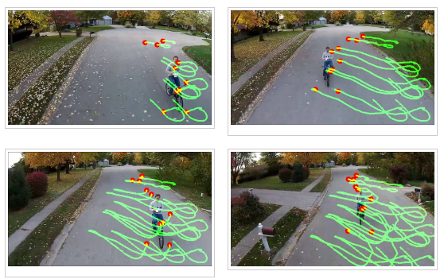

#### 4.5.2. Tracker: Dense Optical Flow:

In this section, we shall implement the Dense Optical Flow tracker in OpenCV Python:
  * Dense optical flow attempts to compute the optical flow vector for every pixel of each frame.
  * While such computation may be slower, it gives a more accurate result and a denser result suitable for applications such as learning structure from motion and video segmentation.
  * Since Dense Optical Flow tracks every pixel, it does not require an intial set of points or region to track
  * Dense optical flow highlights the pixels that are moving/changing faster than the rest of the image.

<pre style="color:#000020;background:#e6ffff;font-size:10px;line-height:1.5;"># open the video file
cap = cv2.VideoCapture(video_file_path)
# check the status of the opened video file
if not cap.isOpened():
    print("Cannot read video file: " + video_file_path)
    exit();
    
# Grab first frame    
ret, frame1 = cap.read()

# Get gray scale image of first frame and make a mask in HSV color
prvsImg = cv2.cvtColor(frame1,cv2.COLOR_BGR2GRAY)

hsv_mask = np.zeros_like(frame1)
hsv_mask[:,:,1] = 255

# frame counter
frame_counter = 1;

while True:
    ret, frame2 = cap.read()
    nextImg = cv2.cvtColor(frame2,cv2.COLOR_BGR2GRAY)
    
    # Check out the markdown text above for a break down of these paramters, most of these are just suggested defaults
    flow = cv2.calcOpticalFlowFarneback(prvsImg,nextImg, None, 0.5, 3, 15, 3, 5, 1.2, 0)
    
    
    # Color the channels based on the angle of travel
    # Pay close attention to your video, the path of the direction of flow will determine color!
    mag, ang = cv2.cartToPolar(flow[:,:,0], flow[:,:,1],angleInDegrees=True)
    hsv_mask[:,:,0] = ang/2
    hsv_mask[:,:,2] = cv2.normalize(mag,None,0,255,cv2.NORM_MINMAX)
    
    #----------------------------------
    # Display the tracking results:
    #----------------------------------
    # - only do this for some frames
    if ( frame_counter % 100 == 0 ):
        # Convert back to BGR to show with imshow from cv
        bgr = cv2.cvtColor(hsv_mask,cv2.COLOR_HSV2BGR)
        # display the color image 
        cv2.imshow('Tracker: Dense Optical Flow on frame #: ' + str(frame_counter + 1),bgr)
        # save the figure
        # the first frame file name
        output_file_path = "../results/frame-" + str(frame_counter) + "-dense-optical-flow-tracker.jpg"
        # save the frame
        cv2.imwrite(output_file_path, bgr);
    
    # increment the frame counter
    frame_counter = frame_counter + 1
    
    # quit if user hits: ESC
    k = cv2.waitKey(30) &amp; 0xff
    if k == 27:
        break
    
    # Set the Previous image as the next iamge for the loop
    prvsImg = nextImg

    
cap.release()
cv2.destroyAllWindows()
</pre>

* The figures below illustrates the Dense Optical Flow tracking of the points of interest for frame 100, 200, 300 and 400, respectively.

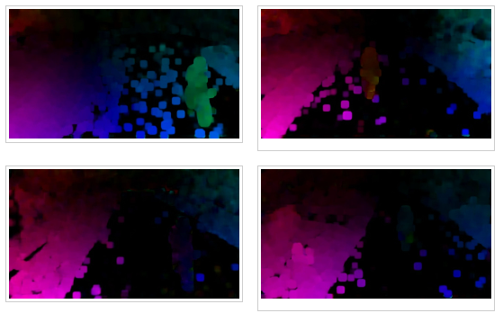

#### 4.5.3. Tracker: Mean-Shift Tracker:

* In this section, we shall implement the Mean-Shift Tracker in OpenCV Python:

<pre style="color:#000020;background:#e6ffff;font-size:10px;line-height:1.5;"># open the video file
cap = cv2.VideoCapture(video_file_path)
# check the status of the opened video file
if not cap.isOpened():
    print("Cannot read video file: " + video_file_path)
    exit();
    
# take first frame of the video
ret,frame = cap.read()

#------------------------------------------------------------
# Set Up the Initial Tracking Window:
#------------------------------------------------------------
# - This is set to the manually selected object of interest 
#   ROI/bounding-box previously selected
#------------------------------------------------------------
#--------------------------------------------
# The object of interest manually annotated 
# bounding-box:
#--------------------------------------------
# TLC coordinates: (tlc_x, tlc_y)
# tlc-x
# tlc_x = 445
# tlc-y
# tlc_y = 100
# the bounding-box dimension
# width
# width = 76
# height
# height = 183
#--------------------------------------------
# setup the tracked window bounding-box in 
# the form: (x,y,w,h)
#--------------------------------------------
track_window = (tlc_x, tlc_y, width, height)
# set up the ROI for tracking
roi = frame[tlc_y:tlc_y+height, tlc_x:tlc_x+width]

# Use the HSV Color Mapping
hsv_roi =  cv2.cvtColor(roi, cv2.COLOR_BGR2HSV)

# Find histogram to backproject the target on each frame for calculation of meanshit
roi_hist = cv2.calcHist([hsv_roi],[0],None,[180],[0,180])

# Normalize the histogram array values given a min of 0 and max of 255
cv2.normalize(roi_hist,roi_hist,0,255,cv2.NORM_MINMAX)

# Setup the termination criteria, either 10 iteration or move by at least 1 pt
term_crit = ( cv2.TERM_CRITERIA_EPS | cv2.TERM_CRITERIA_COUNT, 10, 1 )

# frame counter
frame_counter = 1;

# iterate over the farmes
while True:
    ret ,frame = cap.read()
    if ret == True:
        
        # Grab the Frame in HSV
        hsv = cv2.cvtColor(frame, cv2.COLOR_BGR2HSV)
        
        # Calculate the Back Projection based off the roi_hist created earlier
        dst = cv2.calcBackProject([hsv],[0],roi_hist,[0,180],1)
        
        # Apply meanshift to get the new coordinates of the rectangle
        ret, track_window = cv2.meanShift(dst, track_window, term_crit)
        
        #----------------------------------
        # Display the tracking results:
        #----------------------------------
        # - only do this for some frames
        if ( frame_counter % 100 == 0 ):  
            # Draw the new rectangle on the image
            x,y,w,h = track_window
            img2 = cv2.rectangle(frame, (x,y), (x+w,y+h), (0,0,255),5)
            # display the image
            cv2.imshow('Tracker: Mean-Shift on frame #: ' + str(frame_counter + 1),img2)
            # save the figure
            # the first frame file name
            output_file_path = "../results/frame-" + str(frame_counter) + "-mean-shift-tracker.jpg"
            # save the frame
            cv2.imwrite(output_file_path, img2);

        # increment the frame counter
        frame_counter = frame_counter + 1
        
        # quit if user hits: ESC
        k = cv2.waitKey(1) &amp; 0xff
        if k == 27:
            break
        
    else:
        break
        
cv2.destroyAllWindows()
cap.release()
</pre>

* The figures below illustrates the Mean-Shift flow tracking of the points of interest for frame 100, 200, 300 and 400, respectively.

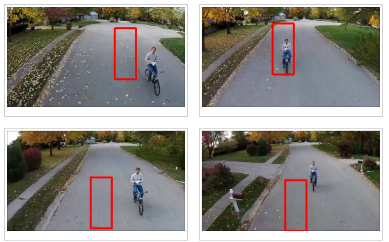

#### 4.5.4.  Tracker: Cam-Shift Tracker:

In this section, we shall implement the Cam-Shift Tracker in OpenCV Python:

<pre style="color:#000020;background:#e6ffff;font-size:10px;line-height:1.5;"># open the video file
cap = cv2.VideoCapture(video_file_path)
# check the status of the opened video file
if not cap.isOpened():
    print("Cannot read video file: " + video_file_path)
    exit();
# take first frame of the video
ret,frame = cap.read()

#------------------------------------------------------------
# Set Up the Initial Tracking Window:
#------------------------------------------------------------
# - This is set to the manually selected object of interest 
#   ROI/bounding-box previously selected
#------------------------------------------------------------
#--------------------------------------------
# The object of interest manually annotated 
# bounding-box:
#--------------------------------------------
# TLC coordinates: (tlc_x, tlc_y)
# tlc-x
# tlc_x = 445
# tlc-y
# tlc_y = 100
# the bounding-box dimension
# width
# width = 76
# height
# height = 183
#--------------------------------------------
# setup the tracked window bounding-box in 
# the form: (x,y,w,h)
#--------------------------------------------
track_window = (tlc_x, tlc_y, width, height)
# set up the ROI for tracking
roi = frame[tlc_y:tlc_y+height, tlc_x:tlc_x+width]

# Use the HSV Color Mapping
hsv_roi =  cv2.cvtColor(roi, cv2.COLOR_BGR2HSV)

# Find histogram to backproject the target on each frame for calculation of meanshit
roi_hist = cv2.calcHist([hsv_roi],[0],None,[180],[0,180])

# Normalize the histogram array values given a min of 0 and max of 255
cv2.normalize(roi_hist,roi_hist,0,255,cv2.NORM_MINMAX)

# Setup the termination criteria, either 10 iteration or move by at least 1 pt
term_crit = ( cv2.TERM_CRITERIA_EPS | cv2.TERM_CRITERIA_COUNT, 10, 1 )

# frame counter
frame_counter = 1;

# iterate over the farmes
while True:
    ret ,frame = cap.read()
    if ret == True:
        
        # Grab the Frame in HSV
        hsv = cv2.cvtColor(frame, cv2.COLOR_BGR2HSV)
        
        # Calculate the Back Projection based off the roi_hist created earlier
        dst = cv2.calcBackProject([hsv],[0],roi_hist,[0,180],1)
        
        # Apply Camshift to get the new coordinates of the rectangle
        ret, track_window = cv2.CamShift(dst, track_window, term_crit)
       
        #----------------------------------
        # Display the tracking results:
        #----------------------------------
        # - only do this for some frames
        if ( frame_counter % 100 == 0 ):  
            # Draw the new rectangle on the image
            pts = cv2.boxPoints(ret)
            pts = np.int0(pts)
            img2 = cv2.polylines(frame,[pts],True, (0,0,255),5)
            cv2.imshow('img2',img2)
            # display the image
            cv2.imshow('Tracker: Cam-Shift on frame #: ' + str(frame_counter + 1),img2)
            # save the figure
            # the first frame file name
            output_file_path = "../results/frame-" + str(frame_counter) + "-cam-shift-tracker.jpg"
            # save the frame
            cv2.imwrite(output_file_path, img2);
        
        # increment the frame counter
        frame_counter = frame_counter + 1
        
        # quit if user hits: ESC
        k = cv2.waitKey(1) &amp; 0xff
        if k == 27:
            break
        
    else:
        break
        
cv2.destroyAllWindows()
cap.release()
</pre>

* The figures below illustrates the Cam-Shift tracking of the points of interest for frame 100, 200, 300 and 400, respectively.

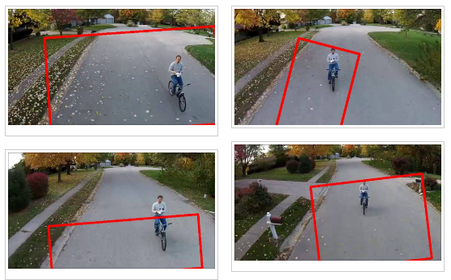

#### 4.5.5. Additional Object Tracking API:

* In this section, we shall implement the Tracking APIs (Built-in with OpenCV):

  * We get the following options to experiment with the following trackers:
    * Enter 0 for BOOSTING
    * Enter 1 for MIL
    * Enter 2 for KCF
    * Enter 3 for TLD
    * Enter 4 for MEDIANFLOW

<pre style="color:#000020;background:#e6ffff;font-size:10px;line-height:1.5;">'''
Gets the user tracker selection:
'''
def ask_for_tracker():
print("Please select the Tracker API would you like to use:")
    print("Enter 0 for BOOSTING: ")
    print("Enter 1 for MIL: ")
    print("Enter 2 for KCF: ")
    print("Enter 3 for TLD: ")
    print("Enter 4 for MEDIANFLOW: ")
    choice = input("Please select your tracker: ")
    
    if choice == '0':
        tracker = cv2.TrackerBoosting_create()
    if choice == '1':
        tracker = cv2.TrackerMIL_create()
    if choice == '2':
        tracker = cv2.TrackerKCF_create()
    if choice == '3':
        tracker = cv2.TrackerTLD_create()
    if choice == '4':
        tracker = cv2.TrackerMedianFlow_create()

    return tracker

# get the Tracker option from the user
tracker = ask_for_tracker()
# display the selected tracker
print("User selected Tracker: " + str(tracker).split()[0][1:])

Please select the Tracker API would you like to use:
Enter 0 for BOOSTING: 
Enter 1 for MIL: 
Enter 2 for KCF: 
Enter 3 for TLD: 
Enter 4 for MEDIANFLOW: 
Please select your tracker: 4
User selected Tracker: TrackerMedianFlow

</pre>

<pre style="color:#000020;background:#e6ffff;font-size:10px;line-height:1.5;"># Get the tracker option from the user
tracker = ask_for_tracker()
# get the tracker name
tracker_name = str(tracker).split()[0][1:]

# open the video file
cap = cv2.VideoCapture(video_file_path)
# check the status of the opened video file
if not cap.isOpened():
    print("Cannot read video file: " + video_file_path)
    exit();
# take first frame of the video
ret,frame = cap.read()

# Special function allows us to draw on the very first frame our desired ROI
roi = cv2.selectROI(frame, False)

# Initialize tracker with first frame and bounding box
ret = tracker.init(frame, roi)

# frame counter
frame_counter = 1;

# iterate over the farmes
while True:
    # Read a new frame
    ret, frame = cap.read()
    
    
    # Update tracker
    success, roi = tracker.update(frame)
    
    # roi variable is a tuple of 4 floats
    # We need each value and we need them as integers
    (x,y,w,h) = tuple(map(int,roi))
    
    # Draw Rectangle as Tracker moves
    if success:
        # Tracking success
        p1 = (x, y)
        p2 = (x+w, y+h)
        cv2.rectangle(frame, p1, p2, (0,255,0), 3)
    else :
        # Tracking failure
        cv2.putText(frame, "Failure to Detect Tracking!!", (100,200), cv2.FONT_HERSHEY_SIMPLEX, 1,(0,0,255),3)

    # Display tracker type on frame
    cv2.putText(frame, tracker_name, (20,400), cv2.FONT_HERSHEY_SIMPLEX, 1, (0,255,0),3);

    #----------------------------------
    # Display the tracking results:
    #----------------------------------
    # - only do this for some frames
    if ( frame_counter % 100 == 0 ):  
        # Draw the new rectangle on the image
        cv2.imshow('Tracker: ' + tracker_name + 'on frame #: ' + str(frame_counter + 1), frame)
        # save the figure
        # the first frame file name
        output_file_path = "../results/frame-" + str(frame_counter) + '--' + tracker_name + ".jpg"
        # save the frame
        cv2.imwrite(output_file_path, frame);
        
    # increment the frame counter
    frame_counter = frame_counter + 1
        
    # Exit if ESC pressed
    k = cv2.waitKey(1) &amp; 0xff
    if k == 27 : 
        break
        
cap.release()
cv2.destroyAllWindows()

Please select the Tracker API would you like to use:
Enter 0 for BOOSTING: 
Enter 1 for MIL: 
Enter 2 for KCF: 
Enter 3 for TLD: 
Enter 4 for MEDIANFLOW: 
Please select your tracker: 4
</pre>

##### 4.5.5.1. Object Tracking API: BOOSTING Tracker

* Enter 0 for BOOSTING
* The figures below illustrates the Boosting tracking of the points of interest for frame 100, 200, 300 and 400, respectively.

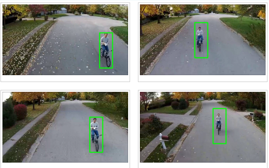

##### 4.5.5.2. Object Tracking API: MIL Tracker

* Enter 1 for MIL
* The figures below illustrates the MIL tracking of the points of interest for frame 100, 200, 300 and 400, respectively.

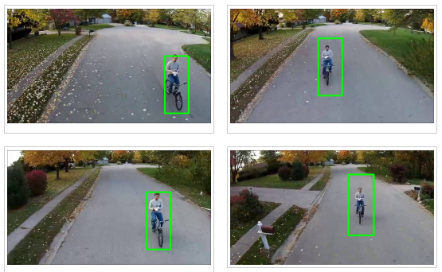

##### 4.5.5.2. Object Tracking API: KCF Tracker

* Enter 2 for KCF
* The figures below illustrates the KCF  tracking of the points of interest for frame 100, 200, 300 and 400, respectively.

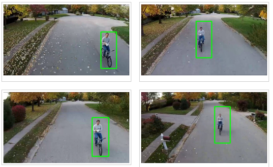

##### 4.5.5.3. Object Tracking API: TLD Tracker

* Enter 3 for TLD
* The figures below illustrates the TLD tracking of the points of interest for frame 100, 200, 300 and 400, respectively.

##### 4.5.5.4. Object Tracking API: MEDIAN FLOW Tracker

* Enter 4 for MEDIANFLOW
* The figures below illustrates the Median-Flow tracking of the points of interest for frame 100, 200, 300 and 400, respectively.

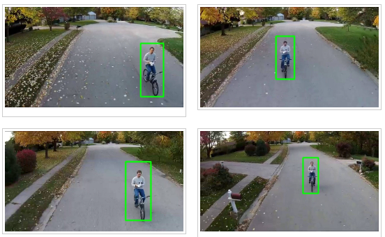

## 5. Analysis

* We have demonstrated tracking a moving object of interest using 9 tracking algorithms implemented in OpenCV Python:

  * The 5 tracking algorithms implemented in the OpenCV Tracking API all performed equally and extremely well, yielding nearly perfect tracking of the moving object of interest.
    * BOOSTING
    * MIL
    * KCF
    * TLD
    * MEDIAN FLOW
  * The other 4 tracking algorithms generally yield poor tracking results:
    * Optical flow
    * Dense optical flow
    * Mean-Shift
    * Cam-Shift

## 6. Future Work

* We propose to explore the following related issues:

  * To explore these implemented tracking algorithm and get a better understating of:
    * How each algorithm works
    * The advantages and limitations of each algorithm
    * To implement multi-object trackers for tracking and distinguishing multiple objects at the same time.

## 7. References

1. Adrian Rosebrock. OpenCV Object Tracking. https://www.pyimagesearch.com/2018/07/30/opencv-object-tracking/ 
2. Adrian Rosebrock. Simple object tracking with OpenCV. https://www.pyimagesearch.com/2018/07/23/simple-object-tracking-with-opencv/ 
3. Satya Mallick. Object Tracking using OpenCV. https://learnopencv.com/object-tracking-using-opencv-cpp-python/ 
4. Anna Petrovicheva. Multiple Object Tracking in Realtime. https://opencv.org/multiple-object-tracking-in-realtime/ 
5. Ehsan Gazar. Object Tracking with OpenCV. https://ehsangazar.com/object-tracking-with-opencv-fd18ccdd7369 
6. Automatic Addison. Real-Time Object Tracking Using OpenCV and a Webcam. https://automaticaddison.com/real-time-object-tracking-using-opencv-and-a-webcam/ 
7. Automatic Addison. How to Do Multiple Object Tracking Using OpenCV. https://automaticaddison.com/how-to-do-multiple-object-tracking-using-opencv/
 
 
